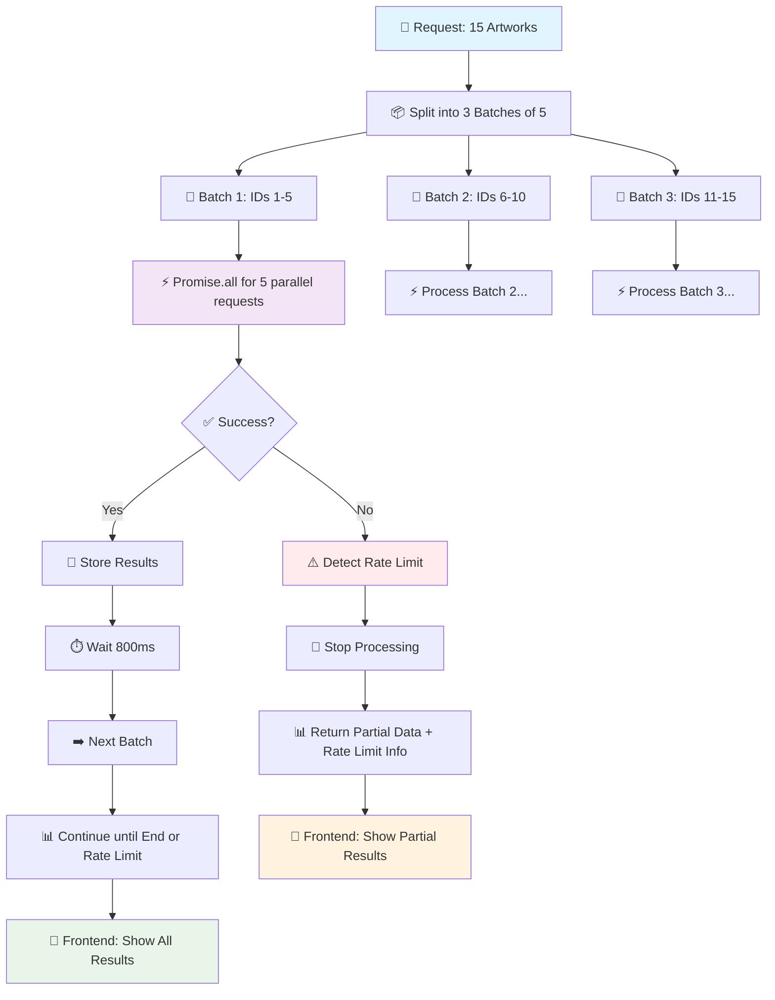

# 🎨 Art Explorer

* Search artworks with images
* View artwork details
* Mark as favorite
* List favorites

## 🚀 Deploy

- **Frontend (Vercel)**: [https://art-explorer-guierba.vercel.app](https://art-explorer-guierba.vercel.app)
- **Backend (Render)**: [https://art-explorer-react-onb5.onrender.com/](https://art-explorer-react-onb5.onrender.com/)

## 🛠️ Stack

### Frontend
- **Framework**: ReactJS + Vite + Typescript
- **Libs**: TailwindCSS, Zustand, Framer Motion, Lucide React, Axios
- **Tests**: Jest + React Testing Library 

### Backend (BFF)
- **Language**: NodeJS + Express + Typescript
- **Libs**: Axios

### Quality
- **Linting**: ESLint + Prettier
- **Standards**: Husky + Lint-staged + Commitlint

## 🏗️ Architecture
I used a BFF approach:
- The **frontend** only talks to our backend
- The **backend** works as a proxy, connecting with the Met Museum API 

## 🚀 How to Run

### Frontend
```bash
# Install dependencies
npm install

# Run in development mode
npm run dev

# Build for production
npm run build

# Run tests
npm test

# Run tests in watch mode
npm run test:watch

# Run tests with coverage
npm run test:coverage
```

### Backend
```bash
# Go to backend folder
cd backend

# Install dependencies
npm install

# Run in development mode
npm run dev

# Build for production
npm run build

# Run in production
npm start
```

### Environment Variables

#### Frontend (.env)
```env
VITE_API_BASE_URL=http://localhost:3001/api
```

#### Backend (.env)
```env
PORT=3001
NODE_ENV=development
CORS_ALLOWED_ORIGINS=http://localhost:5173
RATE_LIMIT_WINDOW_MS=900000
RATE_LIMIT_MAX_REQUESTS=100
```

## 🎯 Main Challenge: API Rate Limiting

### The Problem
Rate Limit because of 15 requests at the same time to get Artwork Details.
Sending all these requests together made the API block the requests.

### The Solution: Batch Processing
I made a **batch processing** system that:

1. **Splits requests into batches** of 5 artworks each time
2. **Adds 800ms delay** between each batch to respect the limits
3. **Watches for errors** and finds rate limiting automatically
4. **Returns partial data** when the limit is reached

```typescript
// Example of batch processing in backend
const BATCH_SIZE = 5;
for (let i = 0; i < objectIDs.length; i += BATCH_SIZE) {
  const batchIds = objectIDs.slice(i, i + BATCH_SIZE);
  
  // Process batch in parallel
  const results = await Promise.all(batchPromises);
  
  // Delay between batches to respect rate limit
  if (i + BATCH_SIZE < objectIDs.length) {
    await new Promise(resolve => setTimeout(resolve, 800));
  }
}
```

### 📊 Batch Processing Flow



## 📋 Extra Items Checklist

⚠️ • **Search bar with autocomplete** (I did not make auto-complete)
✅ • **Filter by department or artist** 
✅ • **Animations with Framer Motion** 
❌ • **Dark mode**
✅ • **Deploy**
✅ • **Zustand**
✅ • **Back-end**
✅ • **Unit Tests** 

## ⏳ Future Improvements

- Add monorepo with TurboRepo 

## 🧪 Tests

The project has these tests:
- **Unit tests** for hooks, services and utilities
- **Integration tests** for React components
- **Behavior tests** that copy user interactions

Run `npm run test:coverage` to see the complete coverage report.

## 📄 License

This project is under the MIT license. See the LICENSE file for more details.

---

